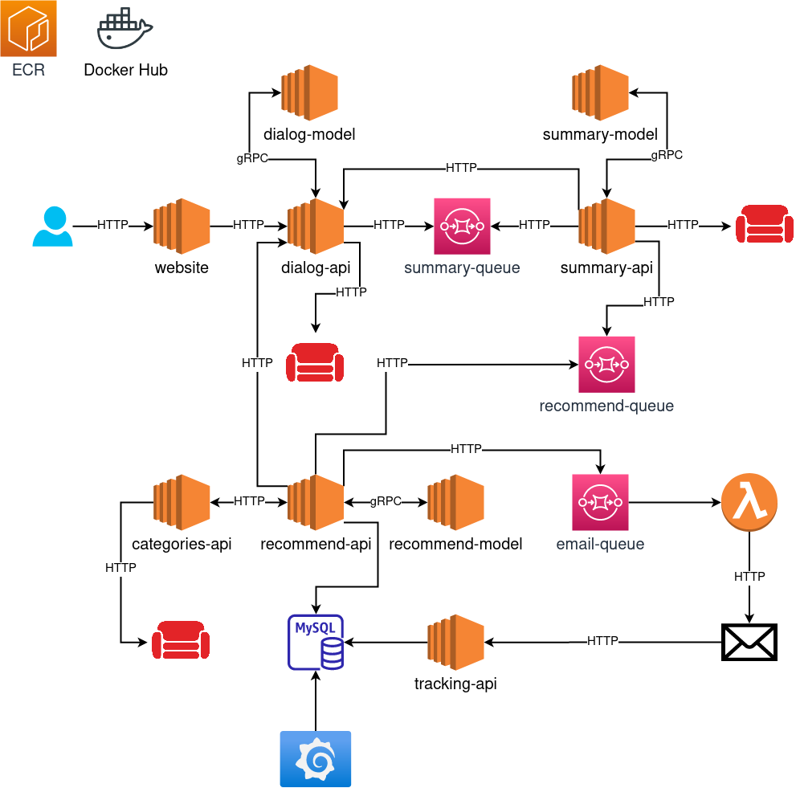

    
    
    
    
    
    
    
    
    
    
    
    
    

# Project description

A recommendation system for recommending products for an online store that consists of the following components:

- [Web application](website)
    - React application that allows users to chat with a chatbot.
- [Dialog API](dialog-api)
    - API for storing dialogs in the database and responding to the user.
- [Dialog model](dialog-model)
    - Machine learning model that generates responses based on the user's input.
- [CouchDB](couchdb)
    - Database for storing dialogs, summaries, and product categories.
- [Summary API](summary-api)
    - API for storing chat summaries in the database.
- [Summary model](summary-model)
    - Machine learning model that generates chat summary.
- [Categories API](categories-api)
    - API for managing product categories.
- [Recommend API](recommend-api)
    - API for recommending products to the user.
- [Recommend model](recommend-model)
    - Machine learning model that recommends products for the user based on the chat.
- [Recommend db](recommend-db)
    - Database for storing recommendations.
- [Recommend email](recommend-lambda)
    - Lambda function that sends a recommendation email to the user.
- [Tracking API](tracking-api)
    - API for tracking user clicks in the email.
- [GitHub Actions](.github/workflows)
    - CI/CD pipelines for the project.
- [Grafana dashboard](monitoring)
    - Dashboard for project monitoring.

AWS services were mainly used for the project infrastructure:

- Amazon SQS
    - Message queue for communication between the components.
- Amazon EC2
    - Virtual machine for hosting the project.
- Amazon ECR
    - Docker container registry for storing Docker images.
        - Due to the free tier limitations, Docker Hub was used for storing images for models.
- Amazon Lambda
    - Serverless computing service for running the recommendation email function.

Due to the complexity of the project, DVC and DagsHub were used for managing the machine learning models and data.

# Project infrastructure

  
   
  <i>Project infrastructure.</i>

 

# Website

  
   
  <i>Website.</i>

# Recommendation email

  
   
  <i>Recommendation email.</i>

# Monitoring

  
   
  <i>Monitoring.</i>

